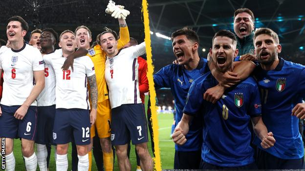

Marcus Rashford, 23

Jadon Sancho, 21

Bukayo Saka, 19

In the Euro Cup 2020, the 3 missed their penalty kicks in  the shootout to give Italy the cup.

Imagine being that age and in that position.
Thousands of fans watching live from the stadium.
Hundreds of thousands more watching from home.
National pride on the line. Your reputation, possibly
even your career. What goes on in your head in those moments?
Is it "I have to make this, I have to make this, I can't miss".
Or is it quiet, a sense of peace, that whether you make it or not doesn't matter.
What matters is the ball, your body, and the goal. 

I can't imagine the amount of pressure these 3 young lads felt in those moments.
Many die hard fans will criticize them for years to come. For these footballers, these moments 
may be entrenched in their memories for a lifetime. It may haunt them or it may make them stronger.
The negative thoughts in their heads in the seconds after their failed attempts will be etched into
their memories. 

>"I failed."

>"I'm not good enough"

>"I don't belong here"

These were the thoughts I had the day before I dropped from OCS. 
I felt broken. Weak. Embarrased for feeling self destructive. I felt inferior. I couldn't keep up.
Those last few hours at OCS are etched in my memories as well. I was also 22, but it felt as if my entire life was crumbling. 

>"Why didn't I try harder." 

>"Why was I so hard on myself"

>"I judged myself to death"

>"I wanted to be perfect, but I just had to be good enough"

The memories from this time has haunted me for the last 2 years. For the first year afterwards I tried
to move on. Focused on finishing school and my future after graduation. The year afterwards the thoughts
came rushing back. I hadn't integrated my experiences into something valuable. I tried to push the emotions away.
I had dreams upon dreams of being back at OCS, each time waking up and staring at the ceiling. I failed. There's no second chances.
It took me until this year 2021, nearly 2 years after my experiences to begin finally reconciling my memories. I read a book on
traumtic experiences. My experiences are no where near the ones that traumtized people go through in childhood
and in war. But in some ways I could relate. The guilt. The shame. The emotions. The inability to enjoy life.

Watching the final seconds of Euro Cup 2020 brought back these memories. These memories of my own failures. I could relate 
to these footballers after their shot didn't go in. I felt a rush of emotions. 

>"I can't 100% experience what these guys are feeling at that moment, but dang do I understand." 

These footballers are still young 
and have a lifetime of professional soccer in front of them. I will never be a professional soccer player, but in those minutes during that 
game I felt more connected to them that I have ever towards an athelete. I will be rooting for them.

>"I allow myself to be human, to make mistakes"

>"I don't have to be perfect"

>"I can and will grow"

>"I am growing"

>"Soham"

>"I am"

