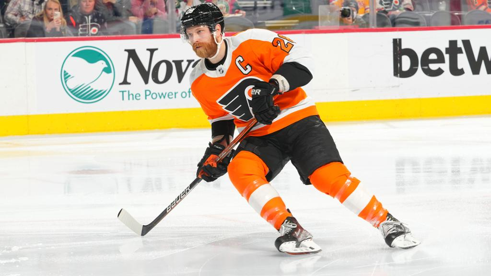

I recently attended an ice skating and remembered a valuable lesson that OCS had taught me. It was one of the toughest lessons I had to learn and 2 years later it was still applicable in my life. 

The lesson: how to respond when you fail or identify a weakness in yourself. 

This was my first week in a seven week ice skating class. I had already taken one set of skating classes, but this time I decided to learn skating for hockey. The people in this class were aspiring hockey players. The majority of them were suit up in hockey attire. They were very comfortable on the ice. I felt my comfort level had gone from a 3/10 to maybe a 6/10 after my first set of lessons, but still felt there was a lot of room for improvement. We progressed in our forward skating, but soon got to our backwards technique. 

The instructor gave out his directions. "Bend your knees, point them inwards and do a backwards C motion"

I listened attentively knowing that going backwards was not something I actively practiced. We were broken into two groups and soon our instructor yelled "First group go!"

I bent my knees, pointed them as inward as I could, and made an attempt at a backwards C. The motion was awkward, I felt uncomfortable, and from the corner of my eyes saw the rest of the group race backwards to a line marked by our instructor. I focused attentively and went an inch a time, making progress and soon heard "Second group go!". The rest of the first group had already finished. I was barely half way across the ice and the second group was racing back towards me. 

I did not want to hold the class up and so skated forwards to the finish. This was definitely something I needed to work on. 

The feeling of being last was the same feeling I felt during our PT runs at OCS. Running was not one of my areas of strength and was an incredible detriment to me. I was chewed out by our Drill Instructor many times for not keeping up. After each run in which I fell behind, I got what we called a Chit. I had to spend valuable night time hours writing an essay to explain why I had lagged behind and what I was going to do going forward. 

In that environment, there was very little I could do. I could stretch during lights out. I could warm up properly. I could focus on my form. But by the time you get to OCS you're either ready or you're not. I overestimated my stamina. 

There would be days in which I would somehow pull it together and stay with the group. As each week went by in OCS though, our Drill Instructor ran faster and faster and expected the same of us. As the platoon ran faster, I fell more and more behind. The feeling of being the last man across the finish line is a feeling I will never forget. A let down. A failure. A burden on my team. A walking disaster. 

Back at the rink those same feelings came rushing back as I practiced my backwards skating. This was different though. I was no longer in the environment of OCS having my every move evaluated. I was no longer being tested for how fast I could go. I was doing this for fun and it fun simply seeing myself get better and learning new techniques. 

I recognized that although I wasn't good right then, I could become better through practice. During my next open skating sessions I would find a corner on the rink and practice going backwards until I was more comfortable. 

Looking back, the reason I lasted as long as I did at OCS was because I never completely lost faith in my self, although that faith was tested to the extreme. Deep down I want to believe my  Drill Instructors believed in me and was rooting for me to succeed knowing my attitude. They knew I had not given up on myself and that I would do everything I could to bounce back. That's what they looked for. At some point though mental attitude needed to turn into physical performance and that never materialized for me. 

In the civilian world, I have all the time in the world to practice my skating techniques. There's no rush. I'm not competing against anyone but myself. I may look clumsy during class, but give me time and I'll practice my way into being comfortable and I know that for a fact. 

So what's the take away? First, you'll look clumsy in anything you're new to doing, that is a given. Second, compete against where you were yesterday, not where someone else is today. Lastly, the only way to get better at anything is to recognize your weaknesses and aggressively and consistently tackle, practice, and refine that weakness so it no longer becomes that. At that point you'll recognize something else to work on and the process repeats. The important thing to recognize is that you'll never not have a weakness and that is okay. 