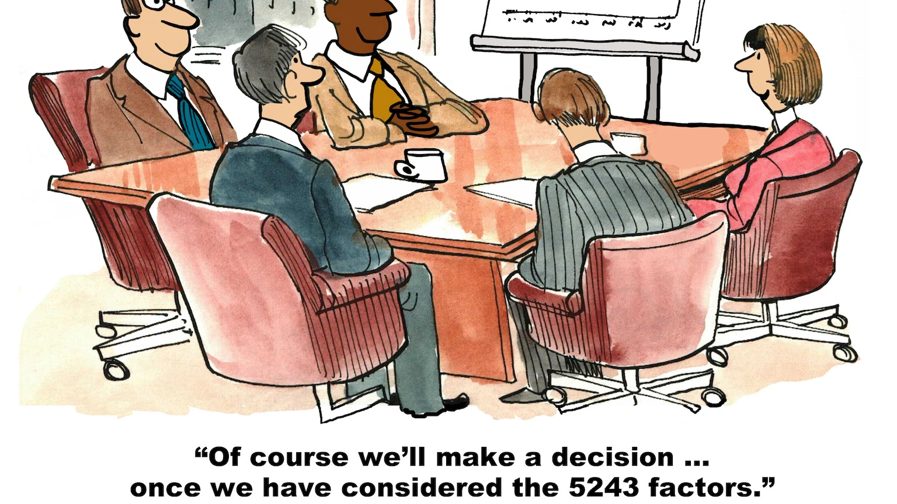

I have always wanted to learn how to draw. The interest goes back to high school when I wanted to pick up a hobby
that was more than video games. I would sit at my desk full of motivation and vigor for what I aspired to be, an artist.
I spent hours digging through tutorials, finding the "best" resources, bookmarking links and scouring the web for PDFs.
I would find books on anatomy, figure drawing, facial expression, composition, color, fundamentals and more. Four hours
of digging later I compiled all of these resources into a folder on my laptop. I would be overwhelmed by the sheer number of stuff I "had" to 
get through. All of that catalytic energy "poof". Exhausted, I licked my wounds, closed the 50 tabs, opened up a video game
and reconsidered if I really wanted to do this. 

A few weeks later once I had replenished my spring of motivation I would open my resources folder and click any PDF that caught my eye.
I flipped through the pages like I could soak up all of the dense material like osmosis. Periodically I catch the vast number of links that 
I had accumulated and once again feel overwhelmed. I said to myself, "This is a waste of time". "This is pointless, I don't see any progress
and it's too hard to commit to learning all of this". Once again, barely having made a mark in my notebook I closed the PDFs. How could I learn something
like this on my own when people went to Art school, studied this stuff for years and practiced everyday to get any good? I opened Youtube and watched
a 15minute video on "How to learn how to draw". The same advice over and over. "Practice", "Draw everyday", "Watch XYZ video", "Subscribe to this class".
Having felt like I now knew what to do and checked off the box of having "done something related to advancing my drawing practice" I called it a day and 
fired up something else to do. Actual practice could wait another week. A week turned into months and months into years.

I don't think gathering resources and figuring out a plan of action is a waste of time, but when all of my energy is used towards planning and not taking action
what can I really show for after all of that time spent? It's the classic analysis paralysis. What I never realized until now was that I needed
a balance of planning and doing. Since I was predisposed to planning, I needed to anchor towards the doing to create balance. 